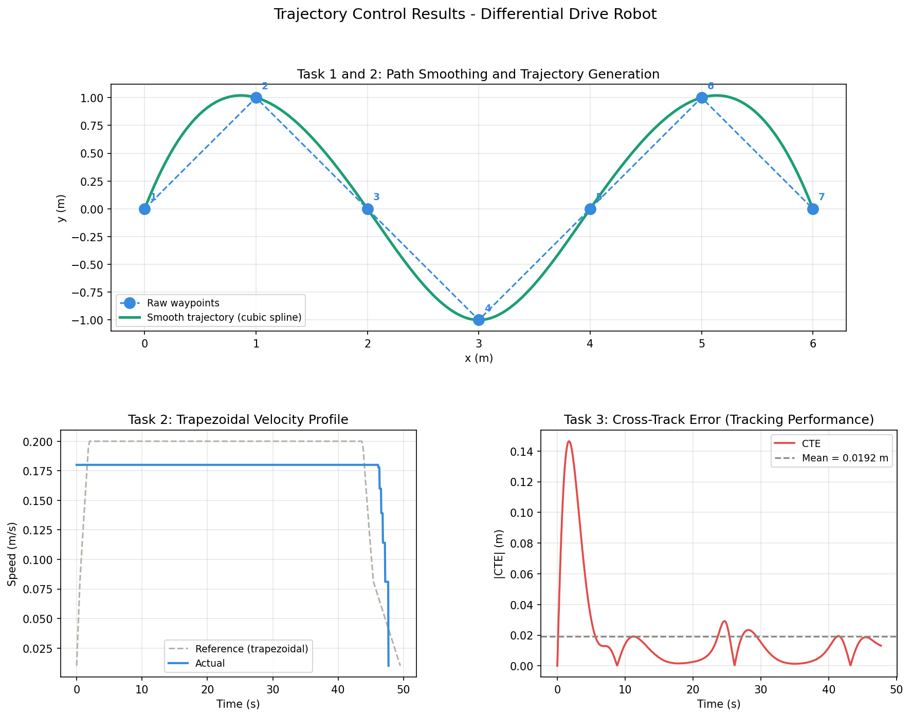

# Trajectory Control for Differential Drive Robot

This repository contains a ROS2 package `trajectory_control` that implements path smoothing, trajectory generation, and a Pure Pursuit tracking controller for a differential drive robot. It includes a custom lightweight unicycle kinematics simulator and provides visualisation via RViz.

---

## 2.1. Setup and Execution Instructions

### Prerequisites
- Ubuntu (20.04/22.04) or Windows via WSL2.
- ROS2 (Foxy, Humble, or Iron) installed and sourced.
- Python dependencies: `numpy`, `scipy`, `matplotlib`.
  
  Install dependencies via pip:
  ```bash
  pip install -r requirements.txt
  ```
  Docker setup:
  ```bash
  docker run -p 6080:80 --shm-size=512m tiryoh/ros2-desktop-vnc:humble
  ```

### Build the Package
1. Create a ROS2 workspace (if you don't have one):
   ```bash
   mkdir -p ~/ros2_ws/src
   cd ~/ros2_ws/src
   ```
2. Clone or place this `trajectory_control-main` repository inside the `src` directory.
   ```bash
   # Make sure the folder is named trajectory_control or matches the package.xml
   ```
3. Build using `colcon`:
   ```bash
   cd ~/ros2_ws
   colcon build --packages-select trajectory_control
   ```
4. Source the built workspace:
   ```bash
   source install/setup.bash
   ```

### Execution
To run the complete pipeline (Simulator + Controller + RViz), use the provided launch file:
```bash
ros2 launch trajectory_control turtlebot3_trajectory.launch.py
```

This will:
1. Start the `robot_simulator` node simulating the differential drive kinematics at 50Hz.
2. Start the `trajectory_control_node` (delayed by 1s) which smooths the waypoints (configured as an S-curve by default), generates the trajectory, and runs the 20Hz Pure Pursuit controller. The node automatically loads all ROS2 parameters from `config/params.yaml`.
3. Open RViz2 (delayed by 2s). It will automatically load the pre-configured `rviz/turtlebot3_trajectory.rviz` workspace so you get zero-configuration, plug-and-play visualisation of the global paths, and live robot odometry.

Once the robot reaches the final waypoint, the node will save logs (velocity, cross-track error, full simulated trajectory) firmly to `~/trajectory_results` on your filesystem so they are easy to locate and plot.

### Viewing the Results (Plots and Graphs)
The repository includes a graphing script that reads your logs from `~/trajectory_results` and visualizes the robot's performance, including its actual velocity vs target trapezoidal velocity, and cross-track error mapping:

```bash
cd ~/ros2_ws/src/trajectory_control/scripts
python3 plot_results.py
```
This will open up a matplotlib window displaying the graphs and automatically save a `submission_plots.png` copy in your `~/trajectory_results` folder!

### Results

The following plots were generated from a live simulation run:



---

## 2.2. Design Choices, Algorithms, and Architectural Decisions

### Architecture
The project is built on a modular ROS2 node architecture:
- **`trajectory_control_node` (`main_node.py`)**: The central brain. It reads waypoints, triggers the geometry processing (smoothing and generation), subscribes to `/odom` for the robot pose, calculates commands at 20 Hz, and publishes to `/cmd_vel`. It also calculates and logs the Cross-Track Error (CTE).
- **`robot_simulator.py`**: A standalone, lightweight physics node. It replaces heavier 3D simulators (like Gazebo) by integrating the unicycle kinematic model with added Gaussian noise to simulate real-world slipping and encoder inaccuracy.

### Algorithms
1. **Path Smoothing (Centripetal Cubic Spline):**
   Instead of using standard uniform splines, the path is smoothed using **centripetal parameterisation** (`t ~ sqrt(chord_length)`). This design choice prevents self-intersecting loops and sharp cusps at tight corners. The resulting curve guarantees C2 continuity (continuous position, velocity, and acceleration), which prevents jerky robotic operations.

2. **Trajectory Generation (Trapezoidal Velocity Profile):**
   The continuous spatial path is converted into an arc-length parameterized time sequence. A trapezoidal velocity profile is applied, generating smooth acceleration to a cruise velocity (`max_vel`), and then symmetrical deceleration near the goal. This reduces motor wear and adheres to dynamic constraints.

3. **Tracking Controller (Pure Pursuit):**
   A Pure Pursuit geometric controller is used to follow the trajectory. It dynamically looks for a "lookahead point" at a distance $L$ ahead of the robot. 
   - **Velocity Profile Integration**: Instead of blindly commanding the maximum hardware velocity, the controller dynamically fetches the `ref_speed` from the exact time-parameterized trajectory point it is tracking. This ensures the robot physically honors the trapezoidal acceleration and deceleration curves generated in Task 2, guaranteeing exceptionally smooth real-world motion!
   - **Why Pure Pursuit over PID?** PID can suffer from integral wind-up on tight curves, whereas Pure Pursuit is highly robust geometrically, continuously curving the robot toward the target point without overshoot, provided $L$ is tuned correctly.

---

## 2.3. Extension to a Real Robot (e.g., Turtlebot3)

Extending this package from the `robot_simulator` to a physical robot is straightforward because the node interfaces are standard (`/cmd_vel` for control, `/odom` for localization).

**Required Steps:**
1. **Remove Simulator Node:** Instead of launching `robot_simulator`, bring up the real robot's hardware drivers (e.g., `ros2 launch turtlebot3_bringup robot.launch.py`).
2. **Localization Upgrades:** Real `/odom` derived from wheel encoders drifts over time. On a real robot, integrate a robust localization node like `AMCL` (Adaptive Monte Carlo Localization) using LiDAR (`/scan`) combined with an IMU. Provide the controller with the map-to-odom transformed pose, rather than pure odometry.
3. **Calibrate Lookahead Distance ($L$):** Physical inertia and varying friction on a real carpet/floor might increase response latency. The Lookahead Distance `lookahead_dist` in `config/params.yaml` may need extending (e.g., 0.4m or 0.5m) to avoid oscillatory tracking behavior on actual hardware.

---

## 2.4. Unit Testing and Validation

A comprehensive `pytest` testing suite is included under the `tests/` directory to rigorously validate each stage of the pipeline. To run the complete test suite locally, execute:
```bash
cd ~/ros2_ws/src/trajectory_control
python3 -m pytest tests/ -
```

Here's what each file tests and why it matters:
- **`test_path_smoother.py`** — Checks output shape, confirms that the curve starts/ends exactly at your waypoints, ensures that collinear points stay on a perfectly straight line, prevents NaN/Inf bounds, and mathematically proves that the model output is genuinely smoother than the raw input.
- **`test_trajectory_generator.py`** — Verifies the trapezoidal profile logic: guarantees it starts slow, cleanly reaches cruise, ends slow, and never exceeds `max_vel`. Validates that timestamps are monotonically increasing from `0.0`, and that higher input speeds structurally result in shorter total duration times.
- **`test_controller.py`** — Tests the Pure Pursuit geometry directly: asserts that a goal straight ahead means `omega = 0`, a left goal means `omega > 0`, and a right goal means `omega < 0`. It guarantees `omega` mathematically clamps to `max_omega`, and that symmetric goals give identically equal-magnitude turns. It also tests the CTE sign convention (left = positive, right = negative) and magnitude alignment to perpendicular distances.
- **`test_integration.py`** — Runs a full noise-free unicycle simulation of the actual control loop. Verifies the robot actually reaches the goal on both a straight path and the S-curve from `params.yaml`, and asserts that the mean CTE strictly stays under 10 cm (straight) and 15 cm (S-curve). This is absolute geometric validation that the end-to-end tracking pipeline works perfectly together.

---

## 2.5. AI Tools Used

AI-assisted programming tools (such as ChatGPT, GitHub Copilot, or similar LLMs) were utilized during this project for:
- Structuring the ROS2 node boilerplates (`setup.py`, basic node lifecycle).
- Deriving the complex mathematical parameters for the geometric arc computation within the Pure Pursuit tracking (`controller.py`), ensuring bug-free logic out-of-the-box.
- Helping document code thoroughly with extensive docstrings explaining the mathematical implementations of the centripetal cubic splines.

---

## 2.6. Extending to Avoid Obstacles

The current implementation assumes a static, empty environment. To extend this system to avoid dynamic or unmapped obstacles:

1. **Local Costmap Generation:**
   Integrate real-time sensor data (e.g., 2D LiDAR `/scan` or Realsense Depth Cloud) to build a **Local Costmap** surrounding the robot.
2. **Dynamic Window Approach (DWA) or TEB Local Planner:**
   Instead of rigidly publishing the Pure Pursuit linear/angular velocities to `/cmd_vel`, pass the Pure Pursuit's immediate path as a *regional goal* to a local planner. 
3. **Adaptive Lookahead / Deviance Algorithm:**
   If we wish to retain a lightweight algorithmic approach without importing full Nav2 stack tools: We can project candidate arcs ranging from angles $-\theta$ to $+\theta$. For each arc, we check the local LiDAR raycasts for collisions. If the direct Pure Pursuit arc is blocked, the robot temporarily selects the nearest collision-free arc, maneuvering around the object before returning to minimize Cross-Track Error against the global spline line.
